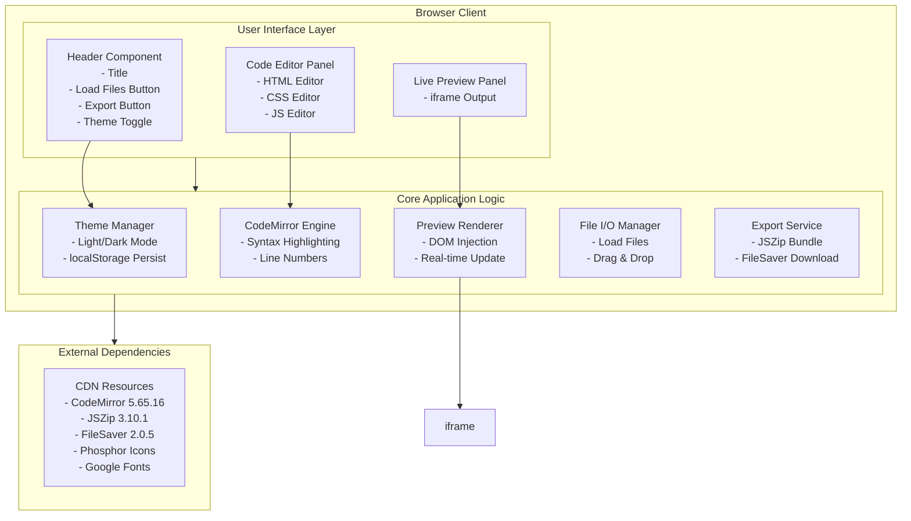

# Code Studio – HTML, CSS & JS Playground

> A powerful, browser-based code editor for building and testing HTML, CSS, and JavaScript in real-time. Instant live preview with export capabilities.

---

## System Architecture



---

## Features

- **Real-time Live Preview** – Instantly see changes as you type in the editors
- **Syntax Highlighting** – Powered by CodeMirror with language-specific modes
- **Dark/Light Theme Toggle** – Switch between themes with persistent storage
- **File Upload Support** – Load external `.html`, `.css`, `.js` files via button or drag & drop
- **One-click Export** – Download all code as a zipped project file
- **Multiple Editor Panels** – Dedicated editors for HTML, CSS, and JavaScript
- **Line Numbers** – Built-in line numbering in all editors
- **Responsive Layout** – Split-panel design adapts to window size

---

## Development Stack

| Category | Technology |
|----------|------------|
| **Core** | Vanilla HTML5, CSS3, JavaScript (ES6+) |
| **Code Editor** | CodeMirror 5.65.16 |
| **Icons** | Phosphor Icons 1.4.2 |
| **Fonts** | Inter (Google Fonts) |
| **Export** | JSZip 3.10.1, FileSaver.js 2.0.5 |
| **CDN** | cdnjs, unpkg, Google Fonts API |

---

## Getting Started

### Quick Start
```bash
# Clone the repository
git clone <repo-url>
cd Code-Studio-HTML-CSS-JS-Playground

# Open in browser
# Simply open index.html in any modern browser
```

### Loading Files
- Click the **Load files** button in the header, or
- **Drag and drop** `.html`, `.css`, or `.js` files directly onto the editor

### Exporting Project
- Click the **Export** button to download a `.zip` file containing:
  - `index.html`
  - `styles.css`
  - `script.js`

---

## Project Stats

```
├── index.html          (309 lines)    Main application
├── README.md           (Current)      Project documentation
```

---

## Configuration

### Theme Variables
Located in `:root` and `[data-theme="dark"]`:

| Variable | Light Mode | Dark Mode |
|----------|------------|-----------|
| `--bg` | `#ffffff` | `#121212` |
| `--bg-panel` | `#fafafa` | `#1e1e1e` |
| `--bg-code` | `#f5f5f5` | `#2b2b2b` |
| `--border` | `#e0e0e0` | `#333` |
| `--text` | `#111` | `#e4e4e4` |
| `--accent` | `#0066ff` | `#80b3ff` |

### Editor Configuration
- **Mode**: `htmlmixed`, `css`, `javascript`
- **Theme**: `default` (light) / `material-darker` (dark)
- **Line Numbers**: `true`
- **Line Wrapping**: `true`

### Local Storage Keys
| Key | Value |
|-----|-------|
| `theme` | `"dark"` or removed |

---

## Browser Compatibility

- **Chrome** / **Edge** 80+
- **Firefox** 75+
- **Safari** 13+
- **Opera** 66+

> Requires ES6+ support and localStorage API

---

## License

MIT License – Feel free to use, modify, and distribute.

---

## Credits

- [CodeMirror](https://codemirror.net/) – Code editor component
- [Phosphor Icons](https://phosphoricons.com/) – Icon library
- [Inter](https://fonts.google.com/specimen/Inter) – Typography